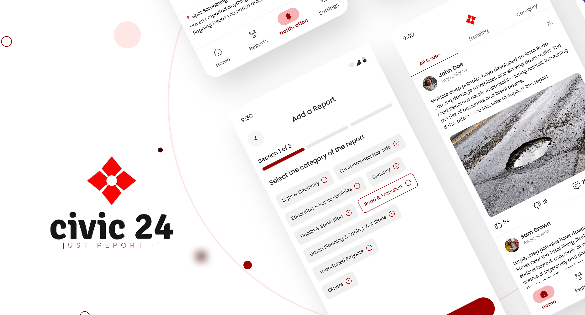

# Civic24



[](https://dart.dev/guides/language/analysis-options)
[](https://opensource.org/licenses/MIT)
[](https://github.com/invertase/melos)


**Civic24** is a mobile platform that empowers people to report civic-related issues in their communities and engage with fellow citizens through feedback and discussion.

This directly aligns with [**SDG Goal 11: Sustainable Cities and Communities**](https://globalgoals.org/goals/11-sustainable-cities-and-communities), which aims to make urban areas inclusive, safe, resilient, and sustainable.

Civic24 also uses **Google’s Generative AI** to validate submitted posts and images, ensuring that only genuinely civic-related content gets shared.

And the best part? It’s **Open Source**. 🧑🏾‍💻

👉 Click here to view the [Civic24 Design Case Study](https://www.behance.net/gallery/229296271/Civic24-Mobile-App-Design-UIUX-Case-Study)

---

## Description
This repository contains the source code for the **Civic24** mobile applications, including:
- **Citizen App**: The main user-facing app that enables individuals to report civic issues, view updates, and participate in public conversations.
- **Admin App**: A web-based dashboard for government officials and administrators to review reports, manage feedback and oversee community activity.
- **Shared Packages**: Modular Dart packages used across both apps to ensure consistent design, localization and shared functionality:
  - `components/`: Reusable UI widgets.
  - `styles/`: Design system and typography.
  - `services/`: Firebase/Supabase integrations.
  - `localization/`, `utils/`, `models/`, etc.

This monorepo is managed using **Melos** to handle interdependencies between packages efficiently.

---

## 🚀 Requirements

Make sure the following tools are installed:

- [Flutter SDK](https://flutter.dev/docs/get-started/install)
- [Dart SDK](https://dart.dev/get-dart)
- [Melos](https://melos.invertase.dev/)
- [Firebase CLI](https://firebase.google.com/docs/cli)
- [Supabase CLI](https://supabase.com/docs/guides/cli)
- [Git](https://git-scm.com/)
- [VS Code](https://code.visualstudio.com/)

---

## 📦 Getting Started

```bash
git clone https://github.com/Civic24HQ/civic24
cd civic24
dart pub global activate melos
melos clean
melos bootstrap
```

This will link all workspace dependencies across apps and packages.

---

## Project Structure

```
civic24/
├── apps/
│   ├── citizen/          # Main user-facing app
│   └── admin/            # Admin dashboard
│
├── packages/
│   ├── assets/           # Images and Fonts Setup
│   ├── components/       # Reusable UI Widgets
│   ├── constants/        # Static Variables and constants
│   ├── localization/     # i18n Setup
│   ├── models/           # Data Models
│   ├── rules/            # Flutter Linter Rules Setup
│   ├── services/         # Firebase, Supabase, API Integrations
│   ├── styles/           # Design System and Typography
│   └── utils/            # Utility Methods
│
├── melos.yaml
├── pubspec.yaml
└── README.md
```

---

## Melos Workspace

### **Common Commands**

```bash
melos bootstrap            # Link and install all packages
melos clean                # Clean all builds
melos flutter:format       # Run custom format script for apps and packages
melos localization:intl    # Generate localization files
melos flutter:build        # Runs build for all apps and packages
melos flutter:analyze      # Static code analysis for apps and packages
```

---

## Firebase & Supabase

- Firebase is used for push notifications (FCM), analytics, and crash reporting.
- Supabase is used for real-time PostgreSQL database, authentication, and storage.

---

## Developer Guidelines

- Follow the Flutter linter rules in `packages/rules/analysis_options.yaml`
- Use consistent commit naming: `feat:`, `fix:`, `chore:`, `refactor:`
- Document all new features in PR Description
- Write unit and golden tests where necessary

---

## 🚦 CI/CD Pipelines

Civic24 uses **GitHub Actions** to automate Continuous Integration (CI), Continuous Deployment (CD) and Pull Request (PR) management.

### Continuous Integration (`ci.yml`)
Runs automatically on all Pull Requests targeting the `develop` branch.

**Key checks include:**
- **Link Packages** – Sets up the monorepo using `melos bootstrap`
- **Code Formatting** – Runs custom format script using `melos run flutter:format`
- **Code Generation** – Runs code generators using `melos run flutter:build`
- **Code Analysis** – Ensures static analysis using `melos run flutter:analyze`

### Continuous Deployment (`cd.yml`)
Handles preview deployments and publishing of artifacts on successful merge to the `main` branch.

**Secrets note:** For flavor-based secrets (e.g., `apps/citizen/secrets/development.json`) store the JSON in a GitHub repository secret encoded in base64 to preserve formatting and avoid shell escaping/newline issues. Example:

```bash
base64 -w0 apps/citizen/secrets/development.json | gh secret set CITIZEN_DEV_SECRETS -b -
```

The workflow decodes this secret at runtime into `apps/citizen/secrets/development.json` before building.

### Pull Request Intelligence (`open_pr.yml`)
This is triggered when a PR is opened or updated. It automatically labels PRs (e.g. `apps/admin`, `packages/constants`) based on which files changed.

### Best Practices
- Use **Draft PRs** while work is in progress.
- Ensure commits pass the CI before requesting review.

---

## 🖼️ Golden Tests Guide

Golden tests capture pixel-perfect snapshots of widgets to catch visual regressions.

### How to Write a Golden Test

Use the `testableWidget` helper to wrap your widget with theme, localization, and layout context.

```dart
testGoldens('MyWidget', (tester) async {
  final builder = GoldenBuilder.column()
    ..addScenario('MyWidget - Active State', testableWidget(const MyWidget()));

  await tester.pumpWidgetBuilder(builder.build());
  await screenMatchesGolden(tester, 'my_widget');
});
```

You can also use `DeviceBuilder` if you want to test responsiveness across devices.

### Running Golden Tests

Run golden tests with:

```bash
flutter test --tags golden
```

To update reference images:

```bash
flutter test --tags golden --update-goldens
```

> Only use `--update-goldens` when you intentionally want to refresh the snapshots.

### Output Location

Golden snapshot images are saved under:

```
goldens/
```

> Each `.png` file is matched against its test description name.

---

## Download Civic24 App (Preview Builds)

You can test the latest preview builds of the Civic24 mobile apps without setting up a development environment.

### Download from Releases
Go to the official [Releases Page](https://github.com/Civic24HQ/civic24/releases/) to download:

- `.apk` file for Android
- `.ipa` file for iOS

Each release contains build artifacts generated from our CI pipelines.

---

## Contribution

1. Fork the repository
2. Create a new branch from `develop`: `git checkout -b feat/amazing-feature`
3. Make your changes, test locally and write a clear well-commented code
4. Run the following commands:
```bash
  melos clean
  melos bootstrap
  melos run flutter:format
  melos run localization:intl
  melos run flutter:build
  melos run flutter:analyze
```
5. Commit your changes: `git commit -m 'Add amazing feature'`
6. Push to the branch: `git push origin feature/amazing-feature`
7. Open a Pull Request with a clear description and screenshots if necessary

---

## Contact & Community

For feedback, ideas or contributions kindly open an issue or connect with me on Twitter [@CalebJesusegun](https://x.com/CalebJesusegun).

Let's build Civic24 together 🌍