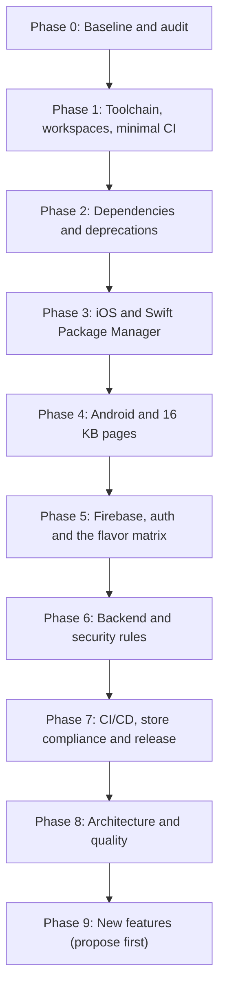

# Civic24 Refactor: Master Prompt

**Role:** senior Flutter and mobile platform engineer (Flutter, Dart, Android Gradle and NDK, iOS Xcode and Swift Package Manager, Firebase)
**Scope:** the Civic24 monorepo (`apps/citizen`, `packages/*`, `backend/*`)
**Targets:** first Apple App Store release, and a production update on Google Play
**Companion files:** `AGENTS.md` (standing repo rules, always applies) and `CHANGE_LOG.md` (the running log you keep)

You are taking over **Civic24**, an open source Flutter monorepo (Melos) where citizens report civic issues and discuss them, like a public feed for community problems. The citizen app (`apps/citizen`) is live on Google Play. It has never shipped to the App Store. Work paused in May 2026. Your job is to bring it back to a reliable, maintainable, reproducible and shippable state on both stores, prepare a verified iOS release, and then build on it.

Treat this as a reliability and release readiness effort first. Upgrade the tooling and prove the core flows work before adding any UI scope. Preserve working product behaviour and existing user data formats.

Read this whole prompt and `AGENTS.md` before you touch anything. Work in phases, strictly in sequence. Do not start a phase until every verification step of the previous one is green.



---

## 1. What you are walking into (from a review on 24 Sept 2026)

Do not assume the dependencies or implementation are untouched or that this list is complete. Inspect the current checkout and confirm each point yourself.

**Repo shape**
- Root: `melos.yaml` (Melos 6.3.3), root `pubspec.yaml` pins `flutter: 3.41.6`, `sdk: >=3.10.7 <4.0.0`. A commented block shows an abandoned attempt at Dart pub workspaces plus Melos 7.
- `apps/citizen` is the real product (about 81 Dart files, views: startup, onboarding, auth, complete_profile, home, main, reports, add_report, notification, settings).
- `apps/admin` is a stub (about 10 Dart files, only startup and home). Treat it as future work: do not expand it during the refactor, but keep it compiling during workspace wide tasks.
- `packages/`: assets, components (with golden tests), constants, localization (intl_utils), models (freezed 3, json_serializable), rules (lints), services (all Firebase, auth, media, location, notifications, Cloudinary, local storage with hive_ce), styles (flex_color_scheme), utils.
- `backend/`: Firestore rules and indexes, Cloud Functions in TypeScript (Node 24, firebase-functions 7, firebase-admin 13; only `index.ts` and `notification.ts`).
- Architecture: Stacked 3.5 (views, viewmodels, generated router and locator via `stacked_generator`). Stacked 3.5.0 was last published about a year ago.
- Flavors: `development`, `staging`, `production` on both platforms. Android application IDs `co.civic24.citizen`, `.dev`, `.stg`. iOS has three schemes plus a Run Script phase that copies `ios/config/<flavor>/GoogleService-Info.plist` at build time.
- Config and secrets: Firebase options come from `--dart-define-from-file=secrets/<flavor>.json` (`apps/citizen/secrets/env.example.json` shows the keys, including `WEB_CLIENT_ID`). iOS Google Sign In (since #61): the client ID is `IOS_CLIENT_ID` in the flavor's secrets JSON, passed from Dart; the reversed client ID URL scheme is written into the built `Info.plist` from the flavor's `GoogleService-Info.plist` by the "Register Google Sign-In URL Scheme" build phase. No xcconfig holds Google values any more.
- Shorebird code push is set up with a separate app ID per flavor (`apps/citizen/shorebird.yaml`, plus `melos run citizen:shorebird:*` scripts).
- Google Sign In already uses the v7 API (`GoogleSignIn.instance`, explicit initialize). Sign in with Apple is present. Media uploads go through Cloudinary.
- Existing unit and golden tests are in place.

**Missing on this machine (gitignored, must be restored or requested; never invent values)**
- `apps/citizen/secrets/{development,staging,production}.json`
- `apps/citizen/android/app/src/{development,staging,production}/google-services.json`
- `apps/citizen/ios/config/{development,staging,production}/GoogleService-Info.plist`
- `apps/citizen/android/key.properties` and the upload keystore

**Problems already found**
1. **Three different Flutter versions.** pubspec says 3.41.6, `cd.yml` says 3.38.7, `.github/workflows/ci` says 3.32.6. Current stable on 24 Sept 2026 is 3.47.5 (Dart 3.13.4); confirm on docs.flutter.dev.
2. **CI file is not running.** `.github/workflows/ci` has no `.yml` extension, so GitHub ignores it. `cd.yml` runs Java 25 for iOS and 21 for Android; `ci` and `open_pr.yml` use Java 18.
3. **iOS Podfile contradicts itself.** `platform :ios, '15.0'` but `post_install` forces every pod to `IPHONEOS_DEPLOYMENT_TARGET = 13.0`, and it silences all warnings.
4. **Crashlytics dSYM upload script depends on CocoaPods** (`$PODS_ROOT/FirebaseCrashlytics`). It will break the moment Firebase moves to Swift Package Manager.
5. **iOS background location.** `Info.plist` lists `location` under `UIBackgroundModes` and includes "always" location usage strings. The app only needs location when in use. This is an App Review rejection trigger.
6. **App Store compliance gaps.** Report or flag, block user, terms (EULA) acceptance and account deletion are incomplete or unverified.
7. **Android Gradle cleanup needed.** `firebase-bom` is added as a plain `implementation` instead of `platform(...)`; `kotlin-stdlib-jdk7:1.9.20` is pinned while the Kotlin plugin is 2.2.20; `google-services` plugin 4.4.0 and Crashlytics plugin 2.9.8 are old; the Firebase Performance Gradle plugin is declared but never applied while `firebase_performance` is used in Dart; Groovy DSL is still used; release uses `proguard-android.txt`.
8. **Firestore rules gaps.** The `uploads` collection is referenced in `FirestoreCollections` but rejected by the rules. Comments and subcollections need rules that let authenticated users comment without being able to change another user's report.
9. **Inactive Firebase project.** The owner received an inactivity notice from Firebase. Project status must be confirmed in the console before any auth or backend verification.
10. **Docs drift.** README says Supabase is used and that Google Generative AI validates posts and images. There is no Supabase code and no Gemini or AI validation code anywhere in the repo. Media goes to Cloudinary. The app README also mentions `main_development.dart` style entry points; the only entry point is `lib/main.dart`.
11. **Discontinued test tooling.** `golden_toolkit` is discontinued. Also, `melos run test:golden` includes `--update-goldens`, so it overwrites baselines.
12. **Melos 6 plus `pubspec_overrides.yaml`** instead of native pub workspaces.

### Phase 0 audit updates (24 Sept 2026, owner approved)

The Phase 0 audit in `CHANGE_LOG.md` confirmed the list above and changed or added the following. Where this section and a phase below differ, this section wins.

- **Versions:** latest stable Flutter is 3.47.5 (Dart 3.13.4) and latest Melos is 8.9.0 (needs pub workspaces). Pin Flutter 3.47.x if the Shorebird CLI supports it. Shorebird's docs list 3.47.1; check 3.47.5 with the CLI.
- **Apple Developer account: none for now.** Everything that needs a paid Apple account is **SUSPENDED (Apple account)** and collected in `docs/APPLE_DEVELOPER_ACCOUNT.md` (ids A1 to A15) for a separate phase later: entitlements and capabilities (Phase 3 item 10), APNs, Sign in with Apple keys, the Apple cells and iOS push in the Phase 5 matrix, production App Check on iOS, signing, fastlane and TestFlight, the App Store checklist, submission and the iOS Shorebird release (Phase 7), iOS push in Phase 9. Do not start or plan around them; continue with everything else and add new items to that file.
- **Firebase layout:** production is `civic24-sdg11`; development and staging share `civic24test-f9352` for now. Revisit a separate staging project before the first App Store release.
- **Phase 1:**
  - Replace the exact `flutter: 3.41.6` pin with a minimum range (for example `>=3.47.0`) in every pubspec, and make `.fvmrc` the exact version. Un-ignore `.fvmrc` in `.gitignore` (it is currently ignored).
  - Repair the broken Melos scripts: `flutter:pod:install` (calls scripts that do not exist), `admin:macos:pods` (wrong scope), `backend:build` and `backend:deploy` (wrong path, should use `backend/functions`). Add the missing `flutter:test` and `citizen:run:*` scripts. Make the golden scripts stop using `--update-goldens` by default.
  - CI must supply non-secret placeholder compile-time values (a file or repeated `--dart-define`) so tests can load. Split this from real secrets.
  - Expect Flutter 3.47 to rewrite `analysis_options.yaml` in members.
- **Phase 2:** the locked `analyzer` 7.7.1 breaks `stackedRouterGenerator` on current Dart; the dependency upgrade must fix it (a dry run resolves `analyzer` 14.x, build_runner 2.16). Upgrade `sign_in_with_apple`, `permission_handler` and `flutter_image_compress` early because their iOS plugins only get Swift Package Manager support in newer versions (Phase 3 depends on it). `golden_toolkit` is confirmed discontinued.
- **Phase 3:** the Podfile also sets `PERMISSION_LOCATION=1` and `PERMISSION_LOCATION_WHENINUSE=0`, which compiles in "always" location; fix it with the Info.plist work. `ITSAppUsesNonExemptEncryption` is the string `NO` and should be boolean false. No `PrivacyInfo.xcprivacy` and no `*.entitlements` file exist; check Push Notifications and Sign in with Apple capabilities in Xcode. `NSLocalNetworkUsageDescription` refers to debugging and ships in release.
- **Phase 4:** `minifyEnabled` is already true but `proguard-rules.pro` does not exist. `usesCleartextTraffic="true"` is set in the main manifest for all flavors; remove it unless a flavor needs it. Location permissions in the manifest are commented out; confirm what the plugins merge in.
- **Phase 5:** production App Check uses `AndroidPlayIntegrityProvider` and `AppleDeviceCheckProvider`; prepare App Attest per step 5.
- **Phase 6:** add the role self-promotion defect to the rules review (D16): `users/{userId}` create does not limit `account.userType`, and `isNotChangingUserType()` compares the top-level key set, so it never matches the nested role. Also check that other users' profiles can be read where "block user" needs it, and how Delete Account removes user data (rules forbid client deletes). Rule changes are proposed to the owner first.
- **CD is paused** (manual runs only) until the app builds again. First CI evidence on Flutter 3.47.5: the Android build needs Gradle 8.14 or newer (Phase 4; Shorebird also lists AGP 8.11.1 and Kotlin 2.2.20), and iOS needs the whole FlutterFire suite at matching versions so Swift Package Manager can resolve it (Phase 2 Group C: `firebase_remote_config 6.2.0` and `firebase_storage 13.0.6` currently conflict). Verify both with a manual `cd.yml` run after those phases.
- **Phase 4 decision:** `permission_handler` is held at 12.0.3 because 13 needs `compileSdk` 37, which needs AGP 9.1.1+ and Gradle 9.3.1+. Decide with the owner: move the app to that toolchain (then upgrade `permission_handler`) or stay on AGP 8.11.x with 12.x. Raise AGP to at least 8.11.1 either way.
- **After Phase 2 (own PR):** fix D17, `PermissionService` loses a permanent denial on Android because it stores `Permission.status`, which cannot report `permanentlyDenied`.
- **Phase 7:** put the `push: branches: [develop]` trigger back in `cd.yml`, then fix the release race in `cd.yml`: the iOS and Android build jobs both create the same release tag, so add one `release` job that waits for both builds (`needs`), downloads their artifacts and publishes once. `cd.yml` has not been run since the Phase 1 CI repair, so test it end to end. Android fastlane has no `Fastfile` (only `Appfile`, `Pluginfile`, README) and iOS has no fastlane folder, so both are written from scratch. Add GitHub Dependabot for pub, npm and GitHub Actions (monthly, Firebase packages grouped).

---

## 2. Rules of engagement

`AGENTS.md` holds the standing rules (commands, conventions, secrets, platform notes, git workflow). Everything below adds to it for this refactor. If the two ever conflict, stop and ask.

**Branching and change size**
- Record the current branch, commit hash and any uncommitted changes (`git status`, `git diff`) before editing. Never overwrite or discard existing work.
- Work on a branch off `develop` for each phase, for example `chore/2026-refactor-phase1`. One phase per pull request, small focused commits, conventional messages (`chore:`, `fix:`, `feat:`, `refactor:`, `test:`, `docs:`).
- Update dependencies first, refactor second, add features third. Never combine them in one PR.
- Do not replace Stacked or redesign the architecture during the refactor. Only make a limited change if code level evidence shows a specific problem that cannot be fixed incrementally. See Phase 8.

**Safety**
- **Never commit secrets**, keystores, provisioning profiles or environment `.json` files. Keep every file listed under "Missing on this machine" gitignored, and check `.gitignore` before every `git add`.
- Never print tokens, credentials, private keys or unnecessary user information in logs, reports or commits.
- Never weaken security rules or disable auth checks to make a test pass.
- Do not change backend schemas, Firebase rules, production data, credentials, signing assets or store listings, and do not deploy or release anything, without explicit authorization from the owner.
- When a decision involves money or billing, cloud project ownership, store consoles, keys or signing certificates, production data or design, stop and write a clear question instead of guessing.

**Research**
- Before each change, read the current official docs or changelog for that package or tool. Your training data is older than this project. Check pub.dev, docs.flutter.dev, firebase.google.com and each package's GitHub releases.
- Upgrade to the latest **compatible** versions, in groups. Read changelogs and breaking changes, keep lockfiles coherent, and avoid unrelated dependency churn.

**Quality gate after every phase**
- `melos bootstrap`, code generation, and `melos run flutter:analyze` with **zero errors and zero warnings**.
- All tests passing.
- The app builds cleanly on both Android (Gradle Kotlin DSL once Phase 4 lands) and iOS (Swift Package Manager once Phase 3 lands), and launches in the development flavor on **both** an iOS Simulator and an Android Emulator. This phase gate is stricter than the per task definition of done in `AGENTS.md`.
- Do not report a build, test, sign in flow or store readiness item as passed unless you actually ran it, with sanitized logs to show for it. If a device, SDK or credential is unavailable, record it as blocked and give the owner a precise list of what is needed.
- State the level of evidence you reached, as defined in `AGENTS.md` (static analysis, local build and tests, or live cloud and device verification).

**Tests during the refactor**
- Add or change tests only to cover a behaviour or regression found during the work. Broader test coverage belongs to Phase 8.
- Do not refresh golden baselines unless there is an intentional visual change. The one exception is the `golden_toolkit` replacement in Phase 2, where new goldens must be compared against the old ones and any visual difference explained.

**`CHANGE_LOG.md`**
Keep a running `CHANGE_LOG.md` in the repo root. It records:
- what changed and why, including every package version bump and its reason
- breaking API migrations and how they were resolved, and what broke and how it was fixed
- device, emulator and simulator verification matrices
- a decision log for every choice with meaningful tradeoffs
- what is still open, and credentials or access still pending from the owner

When a phase changes a command, a version or a convention, also update `AGENTS.md` in the same PR (including its "Current Toolchain & Known Issues" section).

---

## 3. Phases

### Phase 0: Baseline and audit (no code changes)
1. Read `AGENTS.md`, repository guidance, README files, manifests, lockfiles, Melos scripts, CI/CD workflows, app entry points, native platform configuration, Firebase setup and test coverage.
2. Record the local toolchain: `flutter --version`, `dart --version`, Xcode, CocoaPods, Java, Android SDK and NDK, Android Gradle Plugin, Gradle, Kotlin, Node, Firebase CLI, FlutterFire CLI, Shorebird CLI, Melos. Also record the Stacked, Firebase and Google Sign In package versions.
3. Try to build `develop` exactly as it is with Flutter 3.41.6 (use FVM so versions stay pinned per project). Note every failure. This is the "before" picture.
4. Run `flutter pub outdated` in `apps/citizen`, `apps/admin` and every package. Save the output in `CHANGE_LOG.md`.
5. List every plugin that has native iOS code and mark it **Swift Package Manager ready** or **CocoaPods dependent**, based on its official docs. Flag any that are not ready.
6. Document which features and platform targets exist, which tests cover them, current CI behaviour, the available build and run commands, and any generated, ignored, missing or environment specific files that block a reproducible build.
7. Reconcile the repo with its docs. Flag malformed, stale or inconsistent setup instructions and scripts. Confirm GitHub Actions recognises each workflow file and that every Melos command points to a valid script and scope.
8. Confirm the Firebase layout with the owner: separate projects per flavor (for example `civic24-dev`, `civic24-staging`, `civic24-prod`) or one shared project (`apps/citizen/firebase.json` only references `civic24-sdg11`), and which project each flavor points at. Ask the owner to log in to the Firebase console to clear the inactivity warning.

**Deliverables:** `CHANGE_LOG.md` started with the toolchain, the baseline build errors and the Swift Package Manager compatibility list, plus a short, prioritized baseline and risk report and work plan. Separate confirmed defects from recommendations and unknowns, and list dependencies, effort and the external access you will need.

### Phase 1: Toolchain, monorepo foundation and minimal CI repair
1. Pin the latest stable Flutter that Shorebird supports (3.47.x as of 24 Sept 2026; confirm on docs.flutter.dev and with the Shorebird CLI) with FVM via `.fvmrc` at the repo root. Check that Shorebird supports it first; if not, pick the newest version Shorebird supports and note it. Example:
   ```json
   { "flutter": "3.47.5" }
   ```
   Then update `environment` (Flutter and the matching Dart SDK range) in the root pubspec and every `apps/*` and `packages/*` pubspec so they all agree with `.fvmrc`.
2. Migrate to **Dart pub workspaces plus Melos 8**:
   ```yaml
   # root pubspec.yaml
   workspace:
     - apps/*
     - packages/*
   dev_dependencies:
     melos: ^8.9.0   # latest on 24 Sept 2026; confirm on pub.dev
   ```
   Add `resolution: workspace` to every member, move the Melos config into the root pubspec as Melos 8 expects, and delete every `pubspec_overrides.yaml`. Keep every existing Melos script working under the same names (including `flutter:clean`, `flutter:build`, `flutter:analyze`, `flutter:test`, `citizen:build`, `citizen:test`, `citizen:run:*`, `citizen:shorebird:*`).
3. Minimal CI repair, so CI guards every PR from here on:
   - Rename `.github/workflows/ci` to `ci.yml` and confirm it triggers on PR branches.
   - Make **one** source of truth for the Flutter version:
     ```yaml
     - uses: subosito/flutter-action@v2
       with:
         flutter-version-file: '.fvmrc'
         cache: true
     ```
   - One Java version across `ci.yml`, `cd.yml` and `open_pr.yml`: whatever the Android Gradle Plugin requires (17 minimum, 21 if needed), `distribution: 'zulu'`.
   - Upgrade GitHub Actions (`actions/checkout`, `actions/setup-java`, etc.) to their current major versions.
4. Confirm the workspace bootstraps cleanly, and update scripts, docs and `AGENTS.md` so another contributor can repeat setup, generation, analysis, tests and builds.

**Verify:** `dart pub get` at the root with 0 errors, `melos bootstrap` exits 0, CI runs on the PR.

### Phase 2: Dependency upgrade and deprecations
Upgrade in this order, running analyze and tests after each group:
1. **Group A, leaf packages:** `rules` (lints), `constants`, `utils`, `assets`, `styles`.
2. **Group B, localization and models:** `localization` (intl_utils), then `models` (freezed, json_serializable, build_runner) and regenerate with `dart run build_runner build --delete-conflicting-outputs`.
3. **Group C, services:** the FlutterFire suite as one compatible set, bumped together (`firebase_core`, `firebase_auth`, `cloud_firestore`, `firebase_storage`, `firebase_messaging`, `firebase_analytics`, `firebase_crashlytics`, `firebase_remote_config`, `firebase_app_check`, `firebase_performance`), then `google_sign_in` (latest 7.x, keeping the explicit v7 initialization), `sign_in_with_apple`, `geolocator`, `geocoding`, `permission_handler`, `image_picker`, `image_cropper`, `flutter_local_notifications`, `package_info_plus`, `hive_ce`, `shorebird_code_push`, and the rest.
4. **Group D, UI and apps:** `components`, then `apps/citizen`, then `apps/admin` (keep it compiling).
5. **Stacked:** bump `stacked`, `stacked_services`, `stacked_generator` to their latest stable releases and regenerate `app.locator.dart`, `app.router.dart`, dialogs, bottom sheets and form helpers (`melos run citizen:build`). **Do not replace Stacked in this phase.**
6. **Test tooling:** remove `golden_toolkit` from `packages/components` and move to a maintained option (for example `alchemist`, or plain `flutter_test` goldens), following the golden rule in section 2.
7. **Deprecations** the analyzer reports, for example `Color.withOpacity(a)` to `Color.withValues(alpha: a)`, `WillPopScope` to `PopScope` (moving `onWillPop` to `canPop` and `onPopInvokedWithResult`), and deprecated Material 3 theme properties and color roles in `styles` and `apps/citizen`.

**Verify:** `melos run flutter:build` exits 0, `melos run flutter:analyze` returns zero errors and warnings across the workspace, `melos run citizen:test` passes.

### Phase 3: iOS, Swift Package Manager and native config
Context: Flutter 3.44 makes Swift Package Manager the default. Firebase stops publishing to CocoaPods in October 2026 and the CocoaPods trunk goes read only on 2 December 2026. Current FlutterFire moves Firebase onto Swift Package Manager automatically.
1. Check current Flutter and FlutterFire docs and the Phase 0 plugin list. Confirm whether FlutterFire's supported path handles Firebase for this project automatically. Never add Firebase SDKs by hand or mix package managers so the same dependency resolves twice.
2. Follow docs.flutter.dev "Swift Package Manager for app developers" (enable it with `flutter config --enable-swift-package-manager` if needed). Let the Flutter CLI migrate `Runner.xcodeproj`, then review the diff in `project.pbxproj`.
3. Remove CocoaPods entirely (`Podfile`, `Podfile.lock`, `Pods/`) if every plugin supports Swift Package Manager. If any plugin does not, keep a minimal Podfile only for it, explain the consequences, and list it in `CHANGE_LOG.md` with a plan to replace it.
4. Fix the deployment target: one value (15.0, or higher if the latest Firebase requires it) set in the Xcode project. Remove the `post_install` hook that forces 13.0 and silences warnings.
5. Rewrite the Crashlytics dSYM upload Run Script for Swift Package Manager, using the path the current Firebase docs give (typically `"${BUILD_DIR%Build/*}SourcePackages/checkouts/firebase-ios-sdk/Crashlytics/run"`, or the Swift Package `upload-symbols` script). Confirm a symbolicated test crash appears in Crashlytics.
6. Keep the flavor script that copies `ios/config/<flavor>/GoogleService-Info.plist` into `Runner/`, and make sure it runs before anything that reads Firebase config. Confirm all three flavors still select their correct Firebase and Google Sign In config.
7. Audit the rest of the native config: schemes, build settings, entitlements, URL schemes, notification capabilities and build scripts.
8. `apps/citizen/ios/Runner/Info.plist`:
   - Remove `location` from `UIBackgroundModes`. Keep only `fetch` and `remote-notification`.
   - Remove `NSLocationAlwaysUsageDescription` and `NSLocationAlwaysAndWhenInUseUsageDescription` unless real continuous background tracking is introduced. Only ask for when in use location, at the moment the user opens the camera or taps "Get Current Location".
   - Set `NSLocationWhenInUseUsageDescription` to something accurate, for example: "Civic24 uses your location to tag the precise location of civic issues you report."
   - Check the camera, photo library and notification usage strings, and set `ITSAppUsesNonExemptEncryption` to `false` if the app only uses standard HTTPS.
9. Add `apps/citizen/ios/Runner/PrivacyInfo.xcprivacy` with the required API declarations (at least `NSPrivacyAccessedAPICategoryUserDefaults`) and the data collection types, matching what the plugins and the app actually do.
10. **SUSPENDED (Apple account, A2 to A4 in `docs/APPLE_DEVELOPER_ACCOUNT.md`)**: Push notifications: APNs key uploaded to each Firebase project, Push Notifications and Background Modes capabilities on, entitlements correct per flavor.
11. Apply the same analysis to other Apple targets in the monorepo only if they are maintained or built by CI. Do not silently expand the migration into unrelated targets.

The App Store compliance features themselves (report, block, terms, account deletion) are feature work and live in Phase 7, not here.

**Verify:** `flutter build ios --no-codesign --flavor development -t lib/main.dart --dart-define-from-file=secrets/development.json` succeeds, and Xcode builds with no CocoaPods warnings.

### Phase 4: Android, Kotlin DSL and 16 KB page support
1. Upgrade the Android Gradle Plugin, Gradle wrapper, Kotlin and JDK to the versions the new Flutter template recommends. Run `flutter analyze --suggestions` to see the compatibility matrix.
2. Migrate `apps/citizen/android/settings.gradle`, `android/build.gradle` and `android/app/build.gradle` to Kotlin DSL (`.gradle.kts`), matching a freshly generated Flutter app.
3. Clean up dependencies: `implementation(platform("com.google.firebase:firebase-bom:<latest>"))`, remove `kotlin-stdlib-jdk7:1.9.20`, bump `com.google.gms.google-services` (4.4.2 or newer) and `com.google.firebase.crashlytics` (3.x), and either apply the Performance plugin properly or remove the unused declaration.
4. Release build type:
   ```kotlin
   buildTypes {
       release {
           isMinifyEnabled = true
           isShrinkResources = true
           proguardFiles(
               getDefaultProguardFile("proguard-android-optimize.txt"),
               "proguard-rules.pro"
           )
           signingConfig = signingConfigs.getByName("release")
       }
   }
   ```
   Keep the rules the plugins need, and confirm the release build does not strip anything Firestore, JSON or the plugins rely on. Note: Freezed and json_serializable models are Dart code, so R8 does not touch them. Only add keep rules (for example `-keepattributes *Annotation*,Signature,InnerClasses`, or keeps for annotated native classes) when a real release build crash or a plugin's docs show they are needed, and log why in `CHANGE_LOG.md`.
5. Target the current Google Play required API level (`compileSdk` and `targetSdk` 36 at the time of writing, confirm) and confirm 16 KB page size alignment for native libraries and NDK packaging, as required for Android 15 and later.
6. Inspect the signing config, flavor application IDs and how each flavor selects its Firebase config.

**Verify:** `flutter build apk --flavor development -t lib/main.dart --dart-define-from-file=secrets/development.json` and `flutter build appbundle --flavor production -t lib/main.dart --dart-define-from-file=secrets/production.json` (with minification on) both succeed.

### Phase 5: Firebase projects, auth and Google Sign In across 3 flavors x 2 platforms
**The owner must first log in to the Firebase console and confirm the project(s) are active.** Wait for that confirmation. Also ask for Firebase console access, each flavor and platform's configuration, the Android signing fingerprints, iOS signing access and test accounts before scheduling verification. If any of these are unavailable, finish all independent work and hand back a precise list of what is missing.

1. For each flavor, run `flutterfire configure` against the correct Firebase project and bundle or application ID. Place outputs in the flavor paths listed in section 1. Regenerate the per flavor secrets JSON (from `env.example.json`), including `IOS_CLIENT_ID` (the plist's `CLIENT_ID`). Make sure `WEB_CLIENT_ID` is the Google Cloud OAuth 2.0 Web Client ID of that flavor's Firebase project (a mismatch causes `ApiException 10`).
2. Android: add SHA 1 and SHA 256 for the debug keystore (`~/.android/debug.keystore`), the upload keystore (`key.properties`) **and the Play App Signing key** (Play Console, Release, Setup, App Integrity) to each Firebase Android app. A missing Play signing SHA is the most common reason Google Sign In works locally but fails in production.
3. iOS: confirm each flavor's `GoogleService-Info.plist` is in place and copied correctly, that `IOS_CLIENT_ID` in each secrets JSON matches that plist's `CLIENT_ID`, that the built app's URL scheme matches its `REVERSED_CLIENT_ID` (the build phase writes it; the plist must contain a `REVERSED_CLIENT_ID`), and that the OAuth iOS client exists in Google Cloud for each bundle ID.
4. Confirm the OAuth consent screen is in production mode, not testing, and that each Firebase Auth provider (Google, Apple, Email) is enabled.
5. App Check: in `apps/citizen/lib/bootstrap.dart`, use `AndroidDebugProvider` and `AppleDebugProvider` for development and staging, log the debug token and register it under App Check, Manage Debug Tokens. For production iOS, prepare App Attest with DeviceCheck fallback.
6. Review auth logging for personal or credential data.
7. Run this 12 cell matrix. Production runs only with explicit authorization.

| Flavor | Android Emulator | Android device | iOS Simulator | iPhone |
|---|---|---|---|---|
| development | Google, Email | Google | Google, Apple | Google, Apple |
| staging | Google, Email | Google | Google, Apple | Google, Apple |
| production | Google, Email | Google (Play internal track) | Google, Apple | Google, Apple (TestFlight) |

For each cell verify the Firebase project, bundle or application ID, OAuth client, redirect URL scheme, signing fingerprints and provider state, then test: sign in, cancellation, returning user, sign out, and linking or reauthentication where supported. Record in `CHANGE_LOG.md`: device or simulator model, flavor, platform, provider, account type, result, and sanitized logs.

Also test these journeys:
- **Push notifications:** foreground, background (system tray) and terminated (cold start tap).
- **Report creation:** camera capture, image crop, Cloudinary upload, location tagging and Firestore save.
- **Location permission:** first request, when in use grant, and graceful handling when the user refuses.
- **Feed retrieval** and **Remote Config** fetch, including local fallback defaults.

**Verify:** full matrix recorded as `[Flavor] x [Platform] x [Provider] = VERIFIED` or `BLOCKED (reason)`, and zero unhandled App Check or `ApiException` errors during login or feed retrieval.

### Phase 6: Backend Cloud Functions and security rules
Nothing in this phase is deployed without explicit authorization. When authorized, deploy to development first, then staging. Never production without approval.
1. In `backend/functions/`: `npm ci`, upgrade `firebase-functions`, `firebase-admin`, TypeScript and ESLint (move to flat config, `eslint.config.mjs`). `npm run build` and test in the Firebase Local Emulator Suite (`npm run serve`).
2. Audit `backend/firestore.rules`: review every collection for open reads or writes, add rules for the `uploads` collection, and add rules for comments and subcollections so authenticated users can comment without getting write access to the parent report. Propose rule changes to the owner before deploying them.
3. Redeploy Firestore rules and indexes (when authorized) and verify against staging.

### Phase 7: CI/CD, store compliance and release
1. **CI:** finish `.github/workflows/ci.yml` so it runs on every PR to `develop` and `main`: format, `melos run flutter:analyze` (fail on any warning), tests (unit, widget and golden), and builds for both platforms (development Android APK and iOS with `--no-codesign`). Merge duplicated workflows so there is one CI and one CD (`cd.yml`, `open_pr.yml`), with one Java version and the Flutter version from `.fvmrc`.
2. **Delivery:** audit the existing fastlane setup in `apps/citizen/android/fastlane/` for Play internal track uploads. Add an iOS lane (`apps/citizen/ios/fastlane/Fastfile`) that pushes to TestFlight using App Store Connect API keys. Codemagic or Xcode Cloud are acceptable alternatives; note the choice in the decision log.
3. Run formatting, code generation, analysis, unit and golden tests and the CI equivalent checks. Build and launch development and staging on an Android Emulator and iOS Simulator.
4. Walk the key citizen journeys and review error handling, offline behaviour, accessibility and localisation along the way: onboarding, account creation and sign in, profile completion, report creation with media and location, feed and detail, interactions, notifications, account deletion.
5. **Store compliance work (required before the first App Store submission).** Apple enforces Guideline 1.2 strictly on first submissions of community apps: the app will be rejected if people can post without accepting terms, or cannot flag content and block abusive users.
   - Terms of Use (EULA) acceptance before a user can post, during signup.
   - "Flag / Report" action on feed cards and report details, with flags stored in Firestore.
   - "Block user" on citizen profiles and report details, with blocked user IDs filtered out of feed queries.
   - Account deletion inside the app (Guideline 5.1.1). Verify the "Delete Account" flow in `ProfileViewModel` removes or anonymizes the user in Firebase Auth and Firestore.
6. **App Store first submission checklist:** Apple Developer account active; production bundle ID `co.civic24.citizen` registered in the Apple Developer portal; App Store Connect record with the matching bundle ID; signing certificates and distribution provisioning via automatic signing or match; team config; version and build number; permission descriptions; app privacy "nutrition labels" matching `PrivacyInfo.xcprivacy`; Sign in with Apple offered alongside Google (already present); icons; screenshots for the required device sizes; metadata; release build and export process; and a dedicated reviewer demo account (for example `reviewer@civic24.org`, pre seeded with sample reports and a complete profile, credentials in the App Review notes) so the reviewer never gets stuck on OAuth or SMS login.
7. **Shorebird:** patches cannot cross native changes (Swift, Swift Package Manager or Pod changes, Gradle, Kotlin or Manifest changes, new plugins with native code). Because this refactor changes the Flutter SDK and native code, cut a fresh base release for each platform (with authorization), for example:
   ```bash
   shorebird release android --flavor production --target lib/main.dart -- --dart-define-from-file=secrets/production.json
   shorebird release ios --flavor production --target lib/main.dart -- --dart-define-from-file=secrets/production.json
   ```
   Never push this upgrade to existing users as a Shorebird patch.

**Verify:** CI green on the PR; with authorization, an Android release bundle uploaded to the Play internal testing track and an iOS archive uploaded and processing in TestFlight.

### Phase 8: Architecture and quality (only after Phases 1 to 7 are green)
1. Write a short ADR on Stacked: keep it, or move gradually to a more widely adopted setup (for example Riverpod or Bloc for state, `go_router` for navigation, `get_it` for DI). Stacked 3.5 is structured MVVM and rewriting routing, DI and state together risks regressions in session handling, auth state streams and form lifecycles. Recommend a path, but do not migrate everything at once. If moving, go feature by feature behind the existing service interfaces, only once the app is live on TestFlight and Google Play with green builds.
2. Add a repository layer between viewmodels and Firebase services (for example `ReportRepository`, `UserRepository`, `NotificationRepository`) so viewmodels never run Firestore queries or change raw collections directly.
3. Offline first for the feed and draft reports. Firestore cache is already unlimited; add draft persistence with `hive_ce` so citizens can write reports and attach media offline, with sync when they reconnect.
4. Tests: unit tests for services and viewmodels, golden tests for key components, and at least one `integration_test` covering launch, sign in, create a report with a mocked location, submit, and see it in the feed.
5. Observability: Crashlytics non fatal logging for every caught error in services, and Analytics events for the core funnel, for example `onboarding_started`, `sign_up`, `profile_completed`, `report_drafted`, `report_submitted`, `comment_posted`.
6. Update the README so it matches reality (Cloudinary, no Supabase, the single `lib/main.dart` entry point, how AI moderation actually works).

### Phase 9: New features (propose first, then build)
Write a one page proposal for each and wait for approval before building. Tie each proposal to real user evidence (Analytics, Crashlytics, Play Console, beta feedback) where you can, and clearly label anything speculative. The aim: citizens drop off when forms have too many fields (category, severity, LGA, street address, description), and officials drown in duplicate reports when 40 people post the same burst pipe.
1. **AI moderation and enrichment** (the README already promises this). A Cloud Function (for example `onReportCreated`) calls the current Gemini Flash model through Firebase AI Logic, Vertex AI or the Google Gen AI SDK (check the live model list; do not hardcode an old model). For each new report's text and image it: checks it is a real civic issue (pothole, burst pipe, illegal dumping, broken traffic signal, etc.), not abusive, explicit or personal data; suggests or corrects the category and a severity (Low, Medium, High, Critical); writes a one sentence summary for dashboards. Store the result under `reports/{reportId}/aiAnalysis`. Keep the API key server side, never in the app.
2. **Smart report assist in the app:** in `AddReportView`, an "AI draft assistant" that suggests title, description, category and tags after an image is picked (image to report), and optionally lets users speak the issue and fills the form fields from it (voice to text).
3. **Duplicate detection and clustering:** group reports about the same issue near the same place so people upvote or confirm one thread instead of spawning many. Starting idea to validate: generate text and image embeddings per report in a Cloud Function, and link a new report to an existing active one within about 200 metres with cosine similarity above about 0.85.
4. **Map view** of reports by LGA and state, with filters by category and status.
5. **Status tracking** (reported, acknowledged, in progress, resolved) with push notifications to followers, which feeds the admin app later.
6. **Accessibility and localisation:** dynamic type, screen reader labels, contrast, and Nigerian languages (Yoruba, Hausa, Igbo, Pidgin) in the existing intl setup.
7. **UI refresh** in Material 3 using the existing styles package. Match the case study design, do not invent a new visual language.

---

## 4. Definition of done for the refactor

- Latest stable Flutter and Dart (that Shorebird supports), one version pinned everywhere via `.fvmrc`; native pub workspaces resolve cleanly through Melos 8.
- All packages on current compatible versions, no discontinued packages, zero analyzer errors and warnings (`melos run flutter:analyze`).
- All tests passing (`melos exec -- flutter test`).
- iOS builds with Swift Package Manager and no CocoaPods dependency for Firebase.
- Android builds cleanly with Kotlin DSL, current target SDK and 16 KB page size support.
- Google, Apple and email sign in verified on all 3 flavors on both platforms, recorded in `CHANGE_LOG.md`.
- CI green on every PR. CD produces a Play internal build and a TestFlight build.
- Store compliance features in place (UGC moderation, terms, account deletion, privacy manifest, reviewer account) and the App Store checklist complete.
- App submitted to App Store review.
- README, `AGENTS.md` and `CHANGE_LOG.md` up to date.

## 5. Deliverables and reporting

Deliverables across the project:
1. A concise baseline and risk report (Phase 0).
2. A prioritized implementation plan with dependencies, effort and external access needed.
3. Completed, reviewable changes in focused commits and PRs.
4. A verification report listing the exact checks run, results, the device and flavor matrix, and anything blocked.
5. An iOS release checklist and the remaining owner actions.
6. A short list of product and UI recommendations tied to user evidence, with speculative ideas clearly labelled.

At the end of each phase, report back in this format. Keep it short and specific.

```markdown
### Phase [N] report: [phase title]
- **What changed and why:** (PR link, commits, package migrations, config updates)
- **What broke and how it was fixed:** (compiler errors, dependency conflicts, native build fixes)
- **Verification:** (exact commands run, test results, devices and flavors, level of evidence reached)
- **Blocked on the owner:** (console access, credentials, decisions)
- **Next phase:** (what starts in Phase N+1)
```

---

## Appendix: Notes for the owner (not agent instructions)

**Actions only you can take**
- Log in to Firebase and confirm the project(s) are active; confirm how many projects exist and which flavor uses which.
- Provide Firebase console access, the secrets JSON values, the upload keystore and `key.properties`, and the Play App Signing SHA fingerprints.
- Confirm the Apple Developer account is active, register the bundle ID, give iOS signing access and create the App Store Connect record.
- Upload the APNs key to each Firebase project.
- Set up the reviewer demo account.
- Approve any deploy, rules change, production test or release.

**Traction baseline.** Use Firebase Analytics, Crashlytics, Play Console and beta feedback to see how many people actually use the app. Public repo and social metrics alone cannot answer that.

**Pacing.** Do not try to fix everything in one weekend. Aim for one green phase at a time, for example:
- Day 1: Phase 1 (toolchain, workspaces, CI). Merge.
- Day 2: Phase 2 (dependencies, Stacked regeneration). Merge.
- Day 3: Phase 3 (iOS, Swift Package Manager, privacy manifest).
- Day 4: Phases 4 and 5 (Android Gradle, Firebase auth verification).
- Day 5 onward: Phases 6 and 7 (backend, compliance, CI/CD), then TestFlight and Play internal builds.

Phase 0 comes first and needs no code, so it can run alongside your Firebase and Apple account checks.
