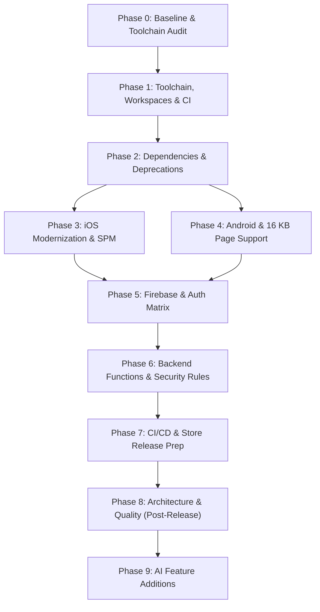

# Civic24 Refactor: Master Agent Brief

You are a senior Flutter and mobile platform engineer (Flutter, Dart, Android Gradle and NDK, iOS Xcode and Swift Package Manager, Firebase) taking over **Civic24**, an open-source Flutter monorepo (Melos) where citizens report civic issues and discuss them, like a public feed for community problems. The citizen app (`apps/citizen`) is live on Google Play. It has never shipped to the Apple App Store. Work paused in May 2026. Your job is to bring it back to a reliable, maintainable, reproducible, and shippable state on both stores, prepare a verified iOS release, and then build on it.

Treat this as a reliability and release readiness effort first. Upgrade the tooling and prove the core flows work before adding any UI scope. Preserve working product behaviour and existing user data formats.

Read this whole brief before touching anything. Work in phases, strictly in sequence. Do not start a phase until every verification step of the previous one is green.

---

## 1. What You Are Walking Into (Codebase Reconnaissance)

Do not assume dependencies or implementations are untouched. Inspect the current checkout and confirm each point yourself.

### 1.1 Repo Shape & Topology
- **Root:** `melos.yaml` (Melos 6.3.3), root `pubspec.yaml` pins `flutter: 3.41.6`, `sdk: >=3.10.7 <4.0.0`. A commented block shows an abandoned attempt at Dart pub workspaces plus Melos 7.
- `apps/citizen`: The primary mobile client (~81 Dart files, views: `startup`, `onboarding`, `auth`, `complete_profile`, `home`, `main`, `reports`, `add_report`, `notification`, `settings`).
- `apps/admin`: Admin dashboard stub (~10 Dart files: `startup`, `home`). **Rule:** Treat as future work; do not refactor or expand unless asked. Just keep it compiling during workspace-wide tasks.
- `packages/`: Modular internal packages:
  - `constants`: Global keys, Firestore collections, and `EnvironmentConstants`.
  - `models`: Data models using `@freezed` 3 and `@JsonSerializable`.
  - `services`: Firebase services (Auth, Firestore, Storage, Messaging, Analytics, Crashlytics, Remote Config, App Check, Performance), Location, Media, Push Notifications, Cloudinary uploads, and local storage (`hive_ce`).
  - `components`: Reusable UI widgets and design system components (contains unit and golden tests).
  - `styles`: Theme (`flex_color_scheme`), typography (Poppins), and spacing tokens.
  - `localization`: Generated translations (`intl`, `intl_utils`). ARB files in `lib/src/l10n/arb/`.
  - `utils`: Helpers, formatters, and custom loggers.
  - `assets`: Images, SVGs, icons, fonts, and `flutter_gen` generated classes.
  - `rules`: Shared analysis options and lint rules (`lib/analysis_options.yaml`).
- `backend/`: Firestore rules and indexes, Cloud Functions in TypeScript (`backend/functions`, Node 24, `firebase-functions` v7, `firebase-admin` v13; `index.ts` and `notification.ts`).
- **Architecture:** Stacked 3.5 (Structured MVVM with generated router and locator via `stacked_generator`).
- **Flavors:** `development`, `staging`, `production` on both platforms. Android application IDs `co.civic24.citizen`, `.dev`, `.stg`. iOS has three schemes plus a Run Script phase that copies `ios/config/<flavor>/GoogleService-Info.plist` at build time.
- **Config & Secrets:** Firebase options come from `--dart-define-from-file` JSON (`apps/citizen/secrets/env.example.json` shows the keys, including `WEB_CLIENT_ID`). iOS Google Sign-In reads `GIDClientID` and `$(GOOGLE_REVERSED_CLIENT_ID)` from per-flavor xcconfig files created from `ios/Flutter/*.xcconfig.template`.
- **Code Push:** Shorebird code push is configured with a separate app ID per flavor (`apps/citizen/shorebird.yaml`, plus `melos run citizen:shorebird:*` scripts).
- **Authentication:** Google Sign-In already uses the v7 API (`GoogleSignIn.instance`, explicit initialize). Sign in with Apple is present.
- **Testing:** Existing unit and golden tests are in place.

### 1.2 Missing on This Machine (Gitignored, Must Be Restored or Requested)
- `apps/citizen/secrets/*.json` for each flavor (`development.json`, `staging.json`, `production.json`)
- `apps/citizen/android/app/src/{development,staging,production}/google-services.json`
- `apps/citizen/ios/config/{development,staging,production}/GoogleService-Info.plist`
- `apps/citizen/ios/Flutter/{Debug,Staging,Release}.xcconfig`
- `apps/citizen/android/key.properties` and the upload keystore

### 1.3 Pre-Identified Technical Debt & Defects
1. **Three Different Flutter Versions:** `pubspec.yaml` specifies `3.41.6`, `cd.yml` specifies `3.38.7`, and `.github/workflows/ci` specifies `3.32.6`. Pin to stable using `.fvmrc`.
2. **CI File is Not Running:** `.github/workflows/ci` has no `.yml` extension, so GitHub Actions ignores it. `cd.yml` runs Java 25 for iOS and 21 for Android; `ci` and `open_pr.yml` use Java 18.
3. **iOS Podfile Contradiction:** Specifies `platform :ios, '15.0'`, but its `post_install` hook forces every pod to `IPHONEOS_DEPLOYMENT_TARGET = 13.0` while muting all compiler warnings.
4. **Crashlytics dSYM Upload Script Couples to CocoaPods:** Uses `${PODS_ROOT}/FirebaseCrashlytics`, which breaks when Firebase moves to Swift Package Manager (SPM).
5. **iOS Background Location Red Flag:** `Info.plist` lists `location` under `UIBackgroundModes` and includes "always" location strings. The app only needs location when in use. This causes immediate App Store rejection.
6. **Android Gradle Cleanup Needed:** `firebase-bom` is added as a plain `implementation` instead of `platform(...)`; `kotlin-stdlib-jdk7:1.9.20` is pinned while the Kotlin plugin is 2.2.20; `google-services` plugin 4.4.0 and Crashlytics plugin 2.9.8 are outdated; the Firebase Performance Gradle plugin is declared but never applied while `firebase_performance` is used in Dart; Groovy DSL is still used; release uses unoptimized `proguard-android.txt`.
7. **Firestore Rules Gaps:** The `uploads` collection is referenced in `FirestoreCollections` but rejected by the rules. Comments and subcollections need rules that let authenticated users comment without mutating another user's report.
8. **Documentation Drift:** `README.md` claims Supabase is used and that Google Generative AI validates posts and images. There is no Supabase code and no Gemini code anywhere in the repo. Media goes to Cloudinary.
9. **Discontinued Test Tooling:** `golden_toolkit` is discontinued and incompatible with modern Flutter SDKs.
10. **Monorepo Tooling:** Melos 6.3.3 plus `pubspec_overrides.yaml` instead of native Dart pub workspaces.
11. **App Store compliance gaps.** Report or flag, block user, terms (EULA) acceptance and account deletion are incomplete or unverified.
12.  **Melos 6 plus `pubspec_overrides.yaml`** instead of native pub workspaces.


---

## 2. Ground Rules

### 2.1 Branching & Change Hygiene
- Record the current branch and uncommitted changes before editing. Never overwrite or discard existing work.
- Work on a new branch off `develop` (e.g., `chore/2026-refactor-phase1`). One phase per pull request, small focused commits, conventional commit messages (`chore:`, `fix:`, `feat:`, `refactor:`).
- **Strict Execution Order:** Upgrade dependencies first $\rightarrow$ Refactor second $\rightarrow$ Add features third. Do not mix them in one PR.
- **Preserve Stacked:** Do not replace Stacked or redesign the architecture during the initial refactor. Only make a limited change if code-level evidence shows a specific problem that cannot be fixed incrementally. Architectural evolution belongs to Phase 8.

### 2.2 Safety & Secrets
- **Never commit secrets**, keystores, or environment `.json` files. Keep every file listed under "Missing on this machine" gitignored, and check `.gitignore` before every `git add`.
- Never print tokens, credentials, private keys, or unnecessary user data in logs, reports, or commits.
- Never weaken Firestore security rules to make a test pass.
- Do not change backend schemas, Firebase rules in production, credentials, signing assets, or store listings without explicit authorization from the human.
- When a decision touches billing, cloud projects, store consoles, or signing certificates, pause and confirm with the owner. Never invent values.

### 2.3 Research & Quality Gates
- Before each change, consult official documentation (`docs.flutter.dev`, `firebase.google.com`, `pub.dev`).
- Upgrade dependencies in compatible groups, keep lockfiles coherent, and avoid unrelated churn.
- **Quality Gate After Every Phase:**
  - `melos bootstrap`, code generation, and `melos run flutter:analyze` with **zero errors and zero warnings**.
  - All unit and widget tests passing.
  - The app builds cleanly on both Android and iOS, and launches on an iOS Simulator and an Android Emulator in the development flavor.
  - Never report a build, test, or sign-in flow as passed unless actually executed. State blockers and missing credentials explicitly.

### 2.4 Testing & Snapshot Rules
- Add or change tests only to cover behavior or regressions found during the refactor. Broader test suites belong to Phase 8.
- **Do not refresh golden baselines** unless there is an intentional visual change. The sole exception is the `golden_toolkit` migration in Phase 2, where new baselines must be visually validated.

### 2.5 Audit Log
Keep a running `CHANGE_LOG.md` in the repo root. It records:
- what changed and why, including every package version bump and its reason
- breaking API migrations and how they were resolved, and what broke and how it was fixed
- device, emulator and simulator verification matrices
- a decision log for every choice with meaningful tradeoffs
- what is still open, and credentials or access still pending from the owner

When a phase changes a command, a version or a convention, also update `AGENTS.md` in the same PR (including its "Current Toolchain & Known Issues" section).

---

## 3. Phased Refactor Roadmap



---

### PHASE 0: Baseline & Audit (No Code Changes)
**Goal:** Establish an immutable record of existing technical debt and platform compatibility before editing files.

1. Read repository guidance, READMEs, manifests, lockfiles, Melos scripts, CI workflows, native platform configs, Firebase setup, and test coverage.
2. Record local toolchain: `flutter --version`, `dart --version`, Xcode, CocoaPods, Java, Android SDK/NDK, Gradle, Kotlin, Node, Firebase CLI, FlutterFire CLI, Shorebird CLI, Melos.
3. Try building `develop` with the current Flutter version (`3.41.6` via FVM). Note every failure in `CHANGE_LOG.md`.
4. Run `flutter pub outdated` across all apps and packages; save the output to `CHANGE_LOG.md`.
5. Audit every plugin with native iOS code to verify Swift Package Manager (SPM) compatibility. Flag any requiring CocoaPods.
6. Reconcile the repo with documentation. Confirm GitHub Actions recognizes each workflow file and that Melos commands map to valid scripts.
7. Confirm with the owner whether each flavor uses its own Firebase project or shares one (`civic24-sdg11`), and confirm the owner has cleared the Firebase inactivity warning.

**Deliverable:** A concise baseline audit and risk report in `CHANGE_LOG.md`.

---

### PHASE 1: Toolchain, Pub Workspaces & Minimal CI Repair
**Goal:** Establish a single source of truth for the Flutter SDK and migrate the monorepo to native Dart pub workspaces.

1. **Pin Flutter with FVM:**
   - Confirm Shorebird supports the chosen stable Flutter version (target latest active stable, e.g., `3.47.x` / Dart `3.13.x` as of 24 Sept 2026, or validated equivalent).
   - Create `.fvmrc` at the repo root:
     ```json
     {
       "flutter": "3.47.5"
     }
     ```
   - Update `environment` constraints across root `pubspec.yaml`, `apps/**/pubspec.yaml`, and `packages/**/pubspec.yaml`:
     ```yaml
     environment:
       sdk: ">=3.10.7 <4.0.0"
       flutter: ">=3.41.6"
     ```
2. **Dart Pub Workspaces & Melos 7 Migration:**
   - In root `pubspec.yaml`:
     ```yaml
     workspace:
       - apps/*
       - packages/*

     dev_dependencies:
       melos: ^7.3.0
     ```
   - In each `packages/*/pubspec.yaml` and `apps/*/pubspec.yaml`, add:
     ```yaml
     resolution: workspace
     ```
   - Delete all `pubspec_overrides.yaml` files.
   - Update `melos.yaml` to Melos 7 standards, keeping all existing script names functional (`flutter:clean`, `flutter:build`, `flutter:analyze`, `citizen:*`).
3. **Minimal CI Repair:**
   - Rename `.github/workflows/ci` $\rightarrow$ `.github/workflows/ci.yml`.
   - Upgrade GitHub Actions to `@v4` (`actions/checkout@v4`, `actions/setup-java@v4`).
   - Standardize Java across workflows to Java 17 LTS (Zulu distribution):
     ```yaml
     - uses: actions/setup-java@v4
       with:
         distribution: 'zulu'
         java-version: '17'
     ```
   - Configure `subosito/flutter-action@v2` to read dynamically from `.fvmrc`:
     ```yaml
     - uses: subosito/flutter-action@v2
       with:
         flutter-version-file: '.fvmrc'
         cache: true
     ```

**Verification:** `dart pub get` at root, `melos bootstrap` succeeds, and `.github/workflows/ci.yml` triggers on PR.

---

### PHASE 2: Dependency Upgrades & Deprecations
**Goal:** Upgrade dependencies in strict topological order, regenerate code artifacts, and eliminate all analyzer warnings.

1. **Upgrade Order:**
   - **Group A (Foundational Leaves):** `packages/rules` (lints), `packages/constants`, `packages/utils`, `packages/assets`, `packages/styles`, `packages/localization`.
   - **Group B (Models & Code Generation):** `packages/models` (`freezed`, `json_serializable`, `build_runner`). Regenerate with:
     ```bash
     dart run build_runner build --delete-conflicting-outputs
     ```
   - **Group C (Services & Plugins):** `packages/services`:
     - FlutterFire suite: Bump all Firebase packages to a unified compatible set.
     - Device plugins: `google_sign_in: ^7.x` (explicit v7 initialization), `sign_in_with_apple`, `geolocator`, `geocoding`, `permission_handler`, `image_picker`, `image_cropper`, `flutter_local_notifications`, `package_info_plus`, `hive_ce`, `shorebird_code_push`.
   - **Group D (Presentation & Applications):** `packages/components`, `apps/citizen`, `apps/admin` (maintain compilation health).
2. **Stacked Regeneration:**
   - Update `stacked`, `stacked_services`, and `stacked_generator`.
   - Run `melos run citizen:build` to regenerate routes, locators, and form helpers. **Do not replace Stacked in this phase.**
3. **Replace Discontinued Test Tools:**
   - Replace `golden_toolkit` with `alchemist` or standard `flutter_test` goldens in `packages/components`.
   - Regenerate golden baselines only where required by the new test harness.
4. **Fix Flutter Deprecations:**
   - `Color.withOpacity(a)` $\rightarrow$ `Color.withValues(alpha: a)`.
   - `WillPopScope` $\rightarrow$ `PopScope` (migrate to `canPop` / `onPopInvokedWithResult`).
   - Fix deprecated Material 3 theme properties.

**Verification:** `melos run flutter:build` exits 0, `melos run flutter:analyze` returns **0 errors and 0 warnings**, and `melos run citizen:test` passes.

---

### PHASE 3: iOS Modernization, Swift Package Manager & App Store Prep
**Goal:** Migrate iOS from CocoaPods to Swift Package Manager, sanitize permissions, and ensure App Store compliance.

1. **Swift Package Manager (SPM) Migration:**
   - Enable SPM: `flutter config --enable-swift-package-manager`.
   - Follow docs.flutter.dev to migrate `apps/citizen/ios/Runner.xcodeproj` to SPM.
   - Check all plugins. If all support SPM, completely decommission CocoaPods (`Podfile`, `Podfile.lock`, `Pods/`). If any plugin strictly requires CocoaPods, retain a minimal Podfile and document in `CHANGE_LOG.md`.
2. **Deployment Target:**
   - Standardize iOS Deployment Target to `15.0` (or higher if required by Firebase) in Xcode project build settings. Remove conflicting `post_install` target overrides.
3. **Crashlytics Run Script Modernization:**
   - In `Runner.xcodeproj/project.pbxproj`, update the Run Script build phase to use the SPM checkouts path:
     ```bash
     "${BUILD_DIR%Build/*}SourcePackages/checkouts/firebase-ios-sdk/Crashlytics/run"
     ```
   - Confirm a symbolicated test crash appears in Crashlytics.
4. **Flavor-Specific GoogleService-Info.plist Script:**
   - Validate that the Xcode build phase script copying `ios/config/<flavor>/GoogleService-Info.plist` to `Runner/GoogleService-Info.plist` executes prior to any Firebase compile or initialization steps.
5. **Info.plist Sanitation & Privacy Manifest:**
   - **CRITICAL:** Remove `<string>location</string>` from `UIBackgroundModes`. Retain only `fetch` and `remote-notification`.
   - Remove `NSLocationAlwaysUsageDescription` and `NSLocationAlwaysAndWhenInUseUsageDescription`. Only request foreground location when the camera opens or the user taps "Get Current Location".
   - Set `NSLocationWhenInUseUsageDescription`:
     > *"Civic24 uses your location to tag the precise geographic coordinates of civic issues you report."*
   - Verify camera, photo library, and notification usage strings.
   - Add `apps/citizen/ios/Runner/PrivacyInfo.xcprivacy` declaring accessed APIs (including `NSPrivacyAccessedAPICategoryUserDefaults`).
6. **Push Notifications:**
   - APNs key uploaded to each Firebase project, Push Notifications and Background Modes capabilities enabled, entitlements correct per flavor.

**Verification:** Terminal build succeeds:
```bash
flutter build ios --no-codesign --flavor development -t lib/main.dart --dart-define-from-file=secrets/development.json
```
and Xcode builds with no CocoaPods warnings.

---

### PHASE 4: Android Build Modernization & 16 KB Page Support
**Goal:** Modernize Android Gradle with Kotlin DSL, support 16 KB page sizes, and meet Google Play 2026 requirements.

1. **Gradle Kotlin DSL (`.gradle.kts`) Migration:**
   - Migrate `settings.gradle`, root `android/build.gradle`, and `app/build.gradle` to `.gradle.kts` following current Flutter engine templates.
2. **Dependency & Plugin Cleanup:**
   - Wrap the Firebase BOM in platform notation:
     ```kotlin
     implementation(platform("com.google.firebase:firebase-bom:34.x.x"))
     ```
   - Remove `org.jetbrains.kotlin:kotlin-stdlib-jdk7:1.9.20`.
   - Upgrade `com.google.gms.google-services` to `4.4.2+` and `com.google.firebase.crashlytics` to `3.0.x+`.
   - Cleanly apply or remove the Firebase Performance Gradle plugin.
3. **ProGuard / Release Optimization:**
   - Configure `buildTypes.release` in `app/build.gradle.kts`:
     ```kotlin
     buildTypes {
         release {
             isMinifyEnabled = true
             isShrinkResources = true
             proguardFiles(
                 getDefaultProguardFile("proguard-android-optimize.txt"),
                 "proguard-rules.pro"
             )
             signingConfig = signingConfigs.getByName("release")
         }
     }
     ```
   - *Note on Freezed models:* Freezed and JSON models are Dart code (compiled to AOT machine code by the Flutter engine); Android R8 does not strip them. Only add keep rules in `proguard-rules.pro` if a specific Java/Kotlin reflection plugin or release crash warrants it:
     ```proguard
     -keepattributes *Annotation*,Signature,InnerClasses
     -keepclassmembers class * {
         @com.google.gson.annotations.SerializedName <fields>;
     }
     ```
4. **Google Play 2026 & 16 KB Page Alignment:**
   - Set `compileSdk = 36`, `targetSdk = 36`.
   - Verify native C/C++ libraries and NDK packaging options support 16 KB memory page size alignment as required for Android 15+.

**Verification:**
```bash
flutter build apk --flavor development -t lib/main.dart --dart-define-from-file=secrets/development.json
flutter build appbundle --flavor production -t lib/main.dart --dart-define-from-file=secrets/production.json
```

---

### PHASE 5: Firebase Projects, Auth & Google Sign-In Matrix
**Goal:** Restore secrets, configure Google Sign-In, and verify authentication across all 3 flavors on both platforms.

> [!IMPORTANT]
> The owner received a Firebase inactivity notice. **The owner must first log in to Firebase Console and confirm project(s) are active before scheduling verification.**

1. **Configure Flavors:**
   - Run `flutterfire configure` against each flavor's Firebase project and bundle/application ID.
   - Populate `apps/citizen/secrets/{development,staging,production}.json` using `secrets/env.example.json`.
   - Ensure `WEB_CLIENT_ID` in each flavor's JSON matches the Google Cloud OAuth 2.0 Web Client ID for that project (prevents `ApiException 10`).
2. **Android Keystores & Fingerprints:**
   - Add SHA-1 and SHA-256 fingerprints to each Firebase Android app:
     1. Local Debug Keystore (`~/.android/debug.keystore`)
     2. Release Upload Keystore (`key.properties`)
     3. **Google Play App Signing Key** (from Play Console $\rightarrow$ App Integrity)
3. **iOS OAuth Configuration:**
   - Set `GIDClientID` and `GOOGLE_REVERSED_CLIENT_ID` in `ios/Flutter/*.xcconfig`.
   - Confirm reversed URL scheme is registered in `Info.plist`.
   - Confirm OAuth consent screen in Google Cloud Console is in **Production** mode (not Testing).
4. **Firebase App Check:**
   - In `apps/citizen/lib/bootstrap.dart`, configure `AndroidDebugProvider` and `AppleDebugProvider` for development and staging.
   - Log debug tokens to the console and register them under App Check $\rightarrow$ Manage Debug Tokens.
5. **Verification Matrix:**
   - Run and record the full matrix in `CHANGE_LOG.md`. *(Production runs only with explicit human authorization).*

| Flavor | Android Emulator | Android Device | iOS Simulator | iPhone Device |
| :--- | :--- | :--- | :--- | :--- |
| **Development** | Google, Email | Google | Google, Apple | Google, Apple |
| **Staging** | Google, Email | Google | Google, Apple | Google, Apple |
| **Production** | Google, Email | Google (Play Internal) | Google, Apple | Google, Apple (TestFlight) |

- Test auxiliary flows: push notifications (foreground, background, terminated), report creation with photo upload, location permission grant/deny, remote config fetch.

**Verification:** Complete matrix recorded; zero App Check or `ApiException` errors during authentication or feed loading.

---

### PHASE 6: Backend Cloud Functions & Security Rules
**Goal:** Modernize backend TypeScript dependencies and secure Firestore rules.

> [!CAUTION]
> **Nothing in this phase is deployed without explicit authorization.** When authorized, deploy to development first, then staging. Never deploy to production without approval.

1. In `backend/functions/`:
   - Run `npm ci`.
   - Upgrade `firebase-functions` to v7+, `firebase-admin` to v13+, TypeScript to v5.7+, and ESLint to flat config (`eslint.config.mjs`).
   - Run `npm run build` and test in the Firebase Local Emulator Suite (`npm run serve`).
2. Audit `backend/firestore.rules`:
   - Review every collection for open reads or writes.
   - Add rules for the `uploads` collection.
   - Add rules for comments and subcollections so authenticated users can comment without modifying another user's root report document.
   - Present proposed rule changes to the human before deployment.
3. Redeploy Firestore rules and indexes (when authorized) and verify in staging.

---

### PHASE 7: CI/CD, Quality & Store Release Prep
**Goal:** Automate CI testing, setup store deployment, and cut fresh Shorebird base releases.

1. **Unified CI Pipeline:**
   - Finalize `.github/workflows/ci.yml` to run on all PRs:
     - `melos run flutter:analyze` (fails on any error or warning)
     - `melos run flutter:test` (unit, widget, golden tests)
     - Build Android APK & iOS Runner (`--no-codesign`)
2. **Fastlane & Distribution:**
   - Verify Android Fastlane for Play Store internal track uploading.
   - Add an iOS Fastlane lane for automated TestFlight distribution.
3. **Walk Key Citizen Journeys:**
   - Review error handling, offline behavior, accessibility, and localization:
     - Onboarding $\rightarrow$ Account Creation/Sign-In $\rightarrow$ Profile Completion $\rightarrow$ Report Creation with Media/Location $\rightarrow$ Feed/Detail $\rightarrow$ Interactions $\rightarrow$ Notifications $\rightarrow$ Account Deletion.
4. **App Store Review Compliance (Guideline 1.2 UGC & Deletion):**
   - EULA/Terms acceptance displayed before posting.
   - "Flag / Report" action on feed cards and report details.
   - "Block user" on citizen profiles and report details (locally filtering blocked IDs from feed queries).
   - In-app Account Deletion verified: confirm `ProfileViewModel` deletion purges user records from Firebase Auth and Firestore.
5. **App Store First-Submission Checklist:**
   - Apple Developer account active, App Store Connect record created for `co.civic24.citizen`.
   - Signing certificates, provisioning profiles, and team configs ready.
   - Privacy manifest and nutrition labels documented.
   - Dedicated reviewer demo account created (`reviewer@civic24.org`, pre-seeded with sample reports and complete profile, credentials placed in review notes).
6. **Shorebird Base Release Protocol:**
   - **CRITICAL RULE:** Shorebird patches cannot modify native code (Swift, SPM, Gradle, Manifests, or new plugins with native code).
   - Because this refactor touches Flutter SDK and native configurations, cut a **fresh base release**:
     ```bash
     shorebird release android --flavor production --target lib/main.dart -- --dart-define-from-file=secrets/production.json
     shorebird release ios --flavor production --target lib/main.dart -- --dart-define-from-file=secrets/production.json
     ```

---

### PHASE 8: Architecture & Quality Improvements (Post-Release)
**Goal:** Clean up technical debt, introduce architectural separation, and improve offline UX. *(Execute only after Phases 1 through 7 are green).*

1. **Architecture Decision Record (ADR) on Stacked:**
   - Author an ADR on state management. Keep Stacked 3.5 for stability, but document a path forward (e.g., Riverpod or Bloc for state, `go_router` for declarative navigation, and `get_it` for DI) behind service interfaces if justified.
2. **Repository Layer Decoupling:**
   - Introduce a repository layer between ViewModels and Firebase services (`ReportRepository`, `UserRepository`) so ViewModels don't execute raw Firestore queries directly.
3. **Offline-First Draft Reports:**
   - Add local draft report persistence using `hive_ce` so citizens can compose reports offline with auto-sync on reconnect.
4. **Integration Testing:**
   - Implement an end-to-end integration test (`package:integration_test`): Open app $\rightarrow$ Sign in $\rightarrow$ Create report with photo $\rightarrow$ View in feed.
5. **Observability & Analytics:**
   - Log non-fatal errors to Firebase Crashlytics across all service catch blocks.
   - Track key funnel events in Firebase Analytics: `onboarding_started`, `profile_completed`, `report_drafted`, `report_submitted`, `comment_posted`.
6. **Update Documentation:**
   - Rewrite `README.md` to reflect actual architecture (Cloudinary media pipeline, no Supabase, accurate roadmap).

---

### PHASE 9: AI Feature Additions (Propose First, Then Build)
**Goal:** Transform Civic24 into an intelligent civic assistant using Google Gemini. *(Require written proposal approval prior to implementation).*

1. **Server-Side AI Moderation & Enrichment (Cloud Functions + current Gemini Flash model):**
   - Create a Cloud Function `onReportCreated`:
     - Call the current Gemini Flash model from the live model list, not a hardcoded old model (keep API credentials strictly server-side).
     - **Validation:** Verify photo depicts a genuine civic issue (pothole, burst pipe, illegal dumping, road hazard) and reject inappropriate, abusive, or sensitive PII content.
     - **Auto-Category & Urgency:** Suggest category and severity (Low, Medium, High, Critical).
     - **Executive Synopsis:** Generate a 1-sentence synopsis formatted for municipal dashboard ingestion.
     - Save metadata to `reports/{reportId}/aiAnalysis`.
2. **Automated Vector Clustering & Deduplication:**
   - Generate embeddings per report. In Cloud Functions, execute spatial and semantic deduplication: if an incoming report is within 200 meters of an active issue and shares cosine similarity $> 0.85$, link it as a "confirmation / upvote" to the existing thread rather than creating duplicate feed noise.
3. **Client-Side Smart Assist UI:**
   - In `AddReportView`: Add an "AI Smart Assist" action that suggests title/category when an image is picked, and optionally allows voice-to-text drafting.
4. **Map & Localization:**
   - Geospatial map view of reports categorized by Local Government Area (LGA) and State.
   - Status tracking progression (Reported $\rightarrow$ Acknowledged $\rightarrow$ In Progress $\rightarrow$ Resolved) with push notifications.
   - Add Nigerian language translations (Yoruba, Hausa, Igbo, Nigerian Pidgin) in `intl_utils`.
   - Refresh UI in Material 3 using the existing `styles` package.

---

## 4. Definition of Done for the Refactor

The refactor is complete when:
1. Flutter and Dart SDK versions are aligned everywhere via `.fvmrc`.
2. All packages are on current compatible versions, with zero analyzer errors and warnings (`melos run flutter:analyze`).
3. All tests pass (`melos exec -- flutter test`).
4. iOS builds with Swift Package Manager and no CocoaPods dependency for Firebase.
5. Android builds cleanly with Kotlin DSL, supports 16 KB memory page sizes, and targets SDK 36.
6. Google Sign-In, Apple Sign-In, and Email auth pass on all 3 flavors across both platforms and are logged in `CHANGE_LOG.md`.
7. CI is green on every PR. CD produces a Google Play internal build and an Apple TestFlight build.
8. Store compliance features (UGC moderation, account deletion, privacy manifest, reviewer demo credentials) are verified.
9. App is submitted to Apple App Store review.
10. `CHANGE_LOG.md` and `README.md` are up to date.

---

## 5. Phase Execution Reporting Template

At the completion of each phase, report back using this format:

```markdown
### Phase [N] Execution Report: [Phase Title]
* **Key Changes:** (Summary of commits, package migrations, configuration updates)
* **Breaking Issues Encountered & Resolved:** (Details of compiler errors, dependency conflicts, native build fixes)
* **Verification Status:** (Terminal commands executed, test results, device/simulator build outcomes)
* **Pending Human Actions:** (Any required console permissions, missing credentials, or owner decisions)
* **Next Phase Objective:** (Clear statement of tasks commencing in Phase N+1)
```

---

## Appendix: Notes for the Owner (Not Agent Instructions)

**Actions Only You Can Take:**
- Log in to Firebase Console and confirm project(s) are active; confirm how many projects exist and which flavor points where.
- Provide Firebase console access, secrets JSON values, the upload keystore, `key.properties`, and Google Play App Signing SHA fingerprints.
- Confirm Apple Developer account is active, provide iOS signing access, and create the App Store Connect application record.
- Upload the APNs authentication key to each Firebase project for iOS push notifications.
- Set up the reviewer demo account (`reviewer@civic24.org`).
- Explicitly approve any cloud deployment, Firestore security rules change, production test, or release.

**Traction Baseline:** Use Firebase Analytics, Crashlytics, Play Console, and beta feedback to see actual user engagement. Public repo metrics alone cannot provide this.

**Pacing:** Do not try to fix everything in a single session. Target one green phase at a time:
- *Day 1:* Phase 1 (Toolchain, Workspaces, CI). Merge.
- *Day 2:* Phase 2 (Dependencies, Stacked codegen). Merge.
- *Day 3:* Phase 3 (iOS, Swift Package Manager).
- *Day 4:* Phases 4 and 5 (Android Gradle, Firebase auth verification).
- *Day 5 onward:* Phases 6 and 7 (Backend, compliance, CI/CD), then TestFlight.
